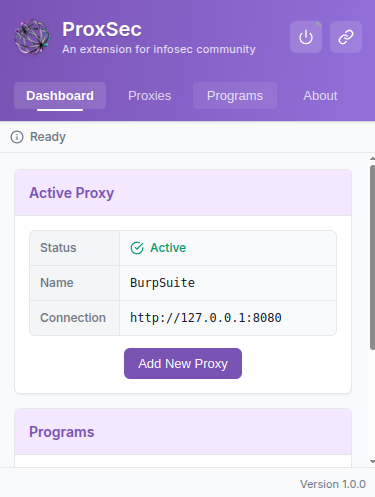
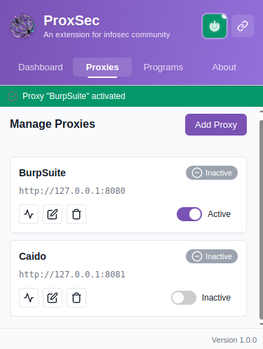
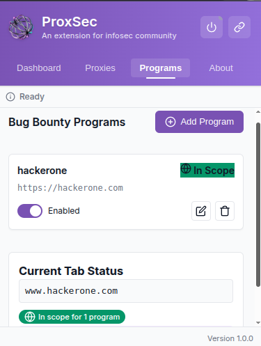
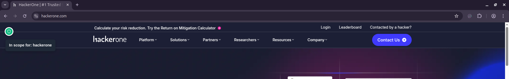

# ProxSec Browser Extension

<div align="center">
  
  <br>
  <h3>Proxy Management for Security Professionals</h3>
  
  
  
  
</div>

## 🔍 Overview

ProxSec is an open-source browser extension designed for bug bounty hunters and security professionals. It streamlines your workflow with efficient proxy management, bug bounty program tracking, and scope checking capabilities - all in a clean, minimalist interface.

## 💡 Why ProxSec?

- **Streamlined Testing:** Quickly toggle proxies on/off without opening multiple tabs or navigating away from your work
- **Stay In Scope:** Avoid out-of-scope testing with real-time domain validation 
- **Time Saving:** Manage all your proxies and programs in one central location
- **Lightweight:** Minimal impact on browser performance
- **Privacy-Focused:** Your data never leaves your browser

## ✨ Features

### 🔄 Proxy Management
- **Quick Toggle:** Enable/disable proxies from any tab with a single click
- **Multiple Configurations:** Store and switch between various proxy setups
- **Protocol Support:** Compatible with HTTP and HTTPS proxies
- **Credentials:** Securely store authentication details for proxies that require them
- **Visual Status:** Clear indicators for active/inactive state

### 🎯 Bug Bounty Programs
- **Program Tracking:** Store details of multiple bug bounty programs
- **Scope Awareness:** Check if domains are in scope for your enrolled programs
- **Domain Patterns:** Support for wildcard domain patterns (e.g., *.example.com)
- **Program Notes:** Keep notes specific to each program

### 🔒 Security & Privacy
- **Local Storage:** All data remains in your browser - nothing is sent to external servers
- **Encrypted Storage:** Sensitive data is encrypted using browser's built-in storage encryption
- **Open Source:** Transparent codebase with MIT license

## 🚀 Installation

### From Web Store
*Coming soon to Chrome Web Store, Firefox Add-ons, and Edge Add-ons*

### Developer Installation
1. Clone this repository
   ```bash
   git clone https://github.com/yourusername/proxsec.git
   ```

2. Open your browser's extension management page:
   - Chrome: Navigate to `chrome://extensions/`
   - Firefox: Navigate to `about:addons`
   - Edge: Navigate to `edge://extensions/`

3. Enable Developer Mode

4. Click "Load unpacked" (Chrome/Edge) or "Load Temporary Add-on" (Firefox) and select the extension directory

## 📖 How to Use

### Managing Proxies
1. Click the ProxSec icon in your browser toolbar
2. Use the quick toggle in the header to enable/disable your active proxy
3. Navigate to the "Proxies" tab to add, edit, or remove proxies
4. Fill in the required details for each proxy:
   - Name: A descriptive name
   - Protocol: HTTP or HTTPS
   - IP Address: Typically 127.0.0.1 for local proxies
   - Port: Common ports include 8080 for Burp Suite, 8090 for OWASP ZAP
   - Username/Password: If required by your proxy

### Tracking Bug Bounty Programs
1. Navigate to the "Programs" tab
2. Click "Add Program" to create a new entry
3. Enter the program details:
   - Name: Organization or program name
   - URL: Program URL
   - Scope Domains: List of in-scope domains, one per line
   - Notes: Any additional information

### Checking Scope
1. Visit any website
2. Open the extension
3. The dashboard will show if the current domain is in scope for any of your programs

## 📸 Screenshots

Here's a visual tour of ProxSec's key features and interface:

### Dashboard Overview

*The main dashboard provides quick access to proxy controls and program status*

### Proxy Management

*Easily configure and manage multiple proxy settings*

### Program Management

*Add and manage bug bounty programs with detailed scope settings*

### Active Monitoring

*Real-time status monitoring and scope validation*

## 🔄 Sample Workflow

Here's a typical workflow example using ProxSec:

1. **Setup your testing proxies**
   ```
   ✅ Add Burp Suite proxy (127.0.0.1:8080)
   ✅ Add OWASP ZAP proxy (127.0.0.1:8090)
   ```

2. **Configure bug bounty programs**
   ```
   ✅ Add "Example Corp" program
   ✅ Add domains: *.example.com, api.example.com
   ✅ Add program notes and details
   ```

3. **Begin testing**
   ```
   ✅ Navigate to target site
   ✅ Toggle proxy ON with one click
   ✅ Extension automatically checks if site is in scope
   ✅ Begin your testing
   ```

4. **Switch tools effortlessly**
   ```
   ✅ Toggle current proxy OFF
   ✅ Select different proxy configuration
   ✅ Toggle new proxy ON
   ✅ Continue testing without disruption
   ```

## 🛠️ Coming Soon
- Note-taking for vulnerabilities
- Customizable recon tools
- Vulnerability report templates

## 🤝 Contributing

Contributions are welcome! Please feel free to submit a Pull Request.

1. Fork the repository
2. Create your feature branch: `git checkout -b feature/amazing-feature`
3. Commit your changes: `git commit -m 'Add some amazing feature'`
4. Push to the branch: `git push origin feature/amazing-feature`
5. Open a Pull Request

## 🔐 Security

If you discover any security issues, please report them via GitHub Issues instead of opening a public issue.

## ⭐ Support

If you find ProxSec helpful for your work:

- Star the GitHub repository
- Share with other security professionals
- Report bugs or suggest features through GitHub Issues
- Consider contributing to the codebase

## 📄 License

This project is licensed under the MIT License - see the LICENSE file for details. 